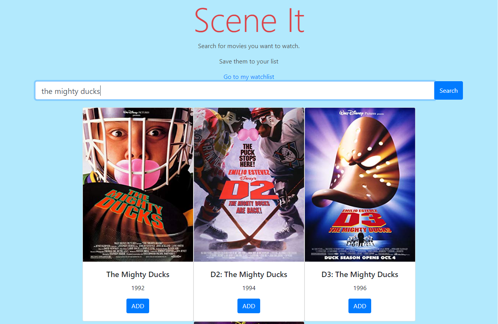

### scene-it

*A watchlist app. See it live [here.](https://gauraklein.github.io/scene-it/)

This project uses the Imdb database to display movies based on a user search query. It also allows users to add films to a watchlist. This project was primarily an exercise in working with Apis well as rendering dynamic results. This app could be improved by added in user accounts and working more in depth with the watchlist feature.

## Technologies Used
- Javascript
- Imdb API
- Axios
- HTML
- CSS
